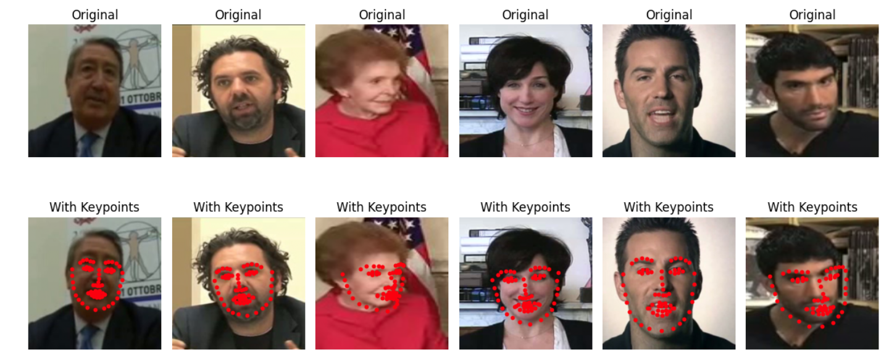

# Facial Keypoint Detection with PyTorch



This repository contains a complete pipeline for detecting **68 facial keypoints** (landmarks) using deep learning with **PyTorch**. The model is based on **transfer learning** with a customized **VGG16** architecture and is trained on a dataset of human face images with annotated keypoints.

---

## Overview

The goal is to locate key facial features such as:
- Eyes and eyebrows
- Nose tip and nostrils
- Mouth and lips
- Jawline

This is achieved by treating the task as a **regression problem**, predicting 136 values (68 x, y coordinate pairs) per face image.

---

## Features

- Custom `Dataset` and `DataLoader` classes for loading and preprocessing data
- Normalization of both image pixels and keypoint coordinates
- Adaptive pooling to make the CNN output shape-independent
- Modified `VGG16` model using a custom classifier head
- Training pipeline with progress bars and real-time loss tracking
- Visualizations for loss curves and predicted keypoints on test images
- Saving and reloading model weights with `state_dict`

---

## Model Architecture

- Base: Pretrained **VGG16** on ImageNet
- Custom `avgpool`: `AdaptiveAvgPool2D(2, 2)`
- Custom classifier:
  - `Linear(2048 → 512)`
  - `ReLU`, `Dropout(0.5)`
  - `Linear(512 → 136)`
  - `Sigmoid` for output scaling

---

## Dataset

- Dataset contains face images and corresponding 68 (x, y) keypoint annotations
- Keypoints are normalized to a 0–1 scale using the image dimensions
- Images are resized to `224x224` and normalized using ImageNet statistics

---

## Loss Function and Optimizer

- **Loss**: `L1Loss` (Mean Absolute Error) – chosen for stability and outlier robustness
- **Optimizer**: `Adam` with a learning rate of `1e-4`

---

## Results

- Training and validation loss curves show smooth convergence
- Predicted keypoints align well with facial features on test images
- Model generalizes across varying poses and lighting conditions

---

## How to Use

1. Clone the repo  
   ```bash
   git clone https://github.com/Arsalanzabeeb786/facial-keypoints-detection-using-pytorch.git
   cd facial-keypoints-detection-using-pytorch
